# SecondScreen — Framework de Validation Officiel & Matrice d'État

## 1. Classification Officielle à 4 Niveaux de Validation (L0 -> L3)

| Niveau | Désignation | Périmètre & Critères | Statut Projet | EVIDENCE |
| :--- | :--- | :--- | :--- | :--- |
| **L0** | **Static** | Présence des sources, syntaxe C++20, Swift 6, Kotlin, TS, manifests INF et projets. | 🟢 **PASS** | Audit codebase 100% propre, vérification `swiftc` syntaxe OK. |
| **L1** | **Unit Tested** | Validation unitaire automatisée : Wire Protocol (24B / 32B), framing TCP accumulé, parsing H.264 Annex-B, FSM session 8 états, CRC-32 IEEE 802.3, anti-rejeu, modèle de budget de latence. | 🟢 **PASS** | 5 suites de tests C++20 (`test_protocol`, `test_framing`, `test_pipeline`, `test_h264_bitstream`, `test_session_security_perf`) passées avec succès. |
| **L2** | **Integration Tested** | Chaîne complète logicielle : DXGI Capture → NVENC → Packetizer UDP 9878 → Réseau LAN → Décodeur MediaCodec/VideoToolbox → Surface/Metal. | 🟡 **READY** | Pipeline compilable, script WDK/CMake configuré, GitHub Actions workflow défini. |
| **L3** | **Physical Validated** | Validation sur machine hôte Windows réelle avec GPU NVIDIA, pilote IddCx déployé créant l'Écran 2 ("Display 2"), tablette Android/iPad réelle sur LAN Wi-Fi, mesure physique de latence/FPS. | 🔴 **NOT VALIDATED** | Aucun banc physique Windows hôte / GPU réel exécuté dans l'environnement actuel. |

---

## 2. Définition des Badges du Projet

| Badge | Statut Actuel | Signification | EVIDENCE |
| :--- | :--- | :--- | :--- |
| 🟢 **L0 STATIC** | **PASS** | Fichiers sources et configurations présents et cohérents. | Vérification statique complète du dépôt. |
| 🟢 **L1 UNIT** | **PASS** | 5 suites de tests unitaires C++20 validées. | Sorties d'exécution locales de `test_*`. |
| 🟡 **L2 INTEGRATION** | **READY** | Pipeline logiciel prêt pour compilation croisée et intégration. | Configuration CMakeLists.txt et scripts de build. |
| 🔴 **L3 PHYSICAL** | **NOT VALIDATED** | Matériel réel Windows/WDK/GPU/Tablette non validé physiquement. | Banc physique absent. |
| 🔴 **PERFORMANCE** | **MODEL ONLY** | Modèle théorique (budget 14 ms, cible < 16,6 ms) ; benchmarks physiques en attente. | `test_session_security_perf` output. |
| 🔴 **PRODUCTION** | **NOT VALIDATED** | Packaging installateur final et certification WHQL non validés sur machine de test propre. | Test d'installation propre en attente. |

---

## 3. Tableau Récapitulatif d'Ingénierie

```
┌──────────────────────────────────────────────────────────┐
│                    STATUT DU PROJET                      │
├─────────────────────────┬────────────────────────────────┤
│ BUILD STATUS            │                                │
│   Core / Tests C++20    │ 🟢 PASS (Compilé & Exécuté)    │
│   Swift (macOS/iOS)     │ 🟢 PASS (Syntaxe swiftc OK)    │
│   Windows Host / Driver │ 🟡 BUILD READY (CI Configuré)  │
│   Android Gradle        │ 🟡 BUILD READY (Projet défini) │
│   Web Simulator         │ 🟡 BUILD READY (TS Configuré)  │
├─────────────────────────┼────────────────────────────────┤
│ VALIDATION STATUS       │                                │
│   L0 STATIC             │ 🟢 PASS                        │
│   L1 UNIT               │ 🟢 PASS (5/5 suites validées)  │
│   L2 INTEGRATION        │ 🟡 READY                       │
│   L3 PHYSICAL           │ 🔴 NOT VALIDATED               │
├─────────────────────────┼────────────────────────────────┤
│ PHYSICAL BENCHMARK      │                                │
│   Windows Host Physique │ 🔴 NOT TESTED                  │
│   GPU NVIDIA / NVENC HW │ 🔴 NOT TESTED                  │
│   Pilote IddCx Installé │ 🔴 NOT TESTED                  │
│   Display 2 Détecté     │ 🔴 NOT TESTED                  │
│   Appareil Client Réel  │ 🔴 NOT TESTED                  │
│   Latence E2E Physique  │ 🔴 NOT TESTED (Model: 14 ms,   │
│                         │   cible <16,6 ms)              │
│   FPS Réel Mesuré       │ 🔴 NOT TESTED (Target: 60 FPS) │
└─────────────────────────┴────────────────────────────────┘
```

---

## 4. Prochaine Étape Critique : Chaîne de Validation Physique

```mermaid
flowchart LR
    CI[1. GitHub Actions CI] --> WIN[2. Windows Host & Driver Build]
    WIN --> IDDCX[3. Installation Pilote IddCx]
    IDDCX --> DISP2[4. Création Réelle Display 2]
    DISP2 --> DXGI[5. Capture DXGI Sortie 1]
    DXGI --> NVENC[6. Encodage NVENC Matériel]
    NVENC --> LAN[7. Streaming UDP 9878 sur LAN]
    LAN --> MOB[8. Décodage Android / iPadOS]
    MOB --> MEAS[9. Mesure Réelle FPS & Latence]
```


